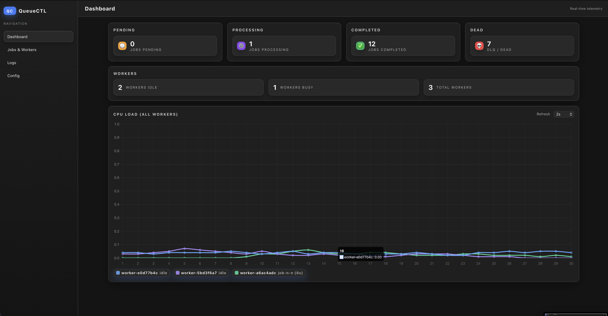
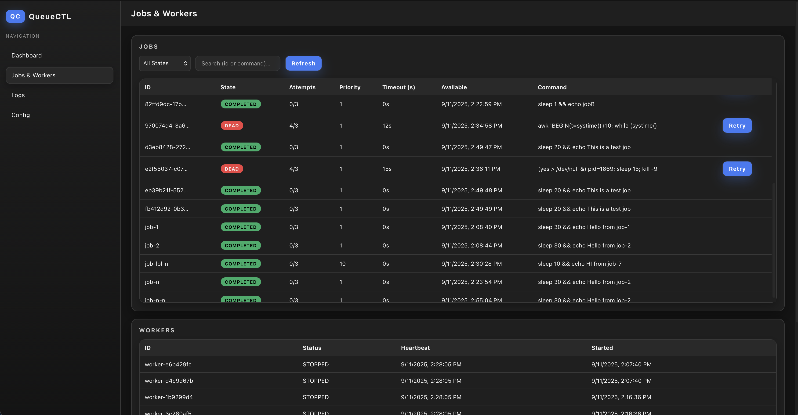
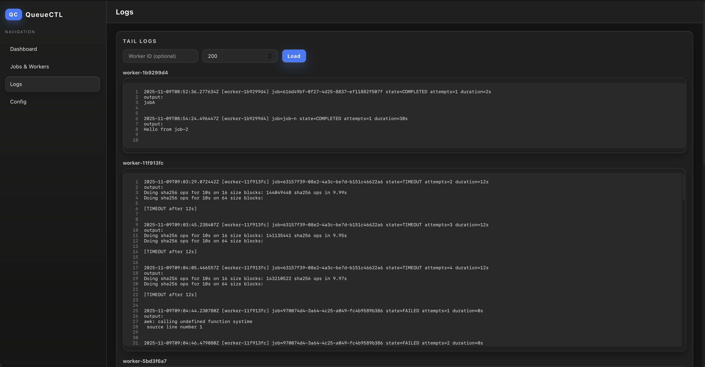
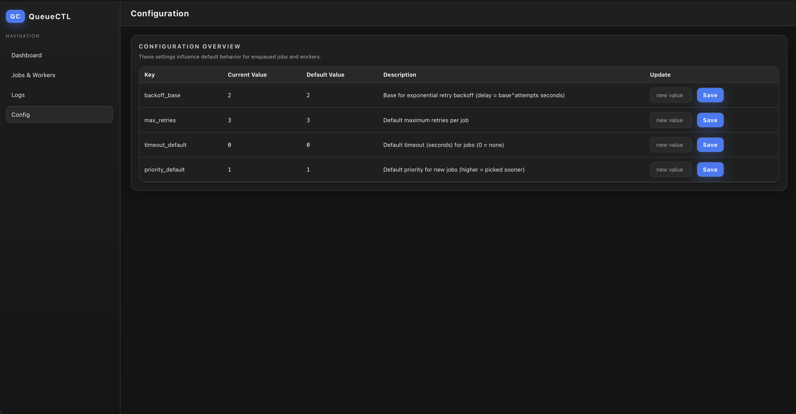

<div align="center">

# QueueCTL

Small, sharp, and reliable. A pragmatic job queue you can run anywhere.

— ship shell commands as background jobs; keep the logs; sleep well.

</div>

---

## What is this?

QueueCTL is a CLI-first background job queue backed by SQLite with:

- Atomic job claiming (no double processing)
- Multiple workers on virtual threads for high concurrency with low footprint
- Exponential backoff retries and a clear Dead Letter Queue (DLQ)
- Scheduling (run_at) and per-job timeouts
- Always-on persistence under `~/.queuectl/`
- Interactive web dashboard (embedded HTTP server) for live metrics, jobs, workers, and logs

Use it to offload long-running or failure-prone tasks, batch jobs, or small automation pipelines without dragging in a whole message broker.

## Table of Contents

- [QueueCTL](#queuectl)
  - [What is this?](#what-is-this)
  - [Table of Contents](#table-of-contents)
  - [Why use QueueCTL?](#why-use-queuectl)
  - [What we optimized for](#what-we-optimized-for)
  - [Install](#install)
    - [Option A: JAR](#option-a-jar)
    - [Option B: Docker](#option-b-docker)
  - [Usage (CLI)](#usage-cli)
  - [Performance Monitor \& Dashboard](#performance-monitor--dashboard)
    - [Features](#features)
    - [API Endpoints (selected)](#api-endpoints-selected)
    - [Screenshots (placeholders)](#screenshots-placeholders)
  - [Sample CPU Spike Commands](#sample-cpu-spike-commands)
  - [Documentation](#documentation)
  - [Videos](#videos)
  - [Demo script](#demo-script)
  - [Notes for operators](#notes-for-operators)
  - [License](#license)

## Why use QueueCTL?

- It’s portable: a single shaded JAR, zero external services.
- It’s disciplined: SQL-first, simple schema, deterministic behavior.
- It’s efficient: workers run on Java 21 virtual threads; idle costs are near-zero.
- It’s observable: per-worker log files, CLI status, and an optional web UI.
- It’s pragmatic: the happy path “just works,” failure paths are first-class.

## What we optimized for

- Virtual threads: each worker runs on `Thread.ofVirtual()`, letting you scale worker counts without burning OS threads.
- SQLite with sane defaults: durable writes, a 5s busy timeout, and compact schema. Atomic UPDATE-based claiming ensures correctness without heavyweight locks.
- Exponential backoff that won’t wake the world: delay = base^attempts with configurable base.
- Scheduling built in: `--run_at` accepts ISO-8601, epoch seconds, or relative `+5s`/`+2m`/`+1h`.
- Timeouts enforced in the worker: no job runs forever.
- Practical web UI: self-hosted, no Node build step. Start/stop from the CLI.

## Install

### Option A: JAR

Requirements: Java 21+, Maven 3.9+

```bash
# One-liner (build + run status)
mvn -DskipTests package && java -jar target/QueueCTL-1.0-SNAPSHOT.jar status

# Or use the wrapper script (auto-builds if needed)
./bin/queuectl status
```

### Option B: Docker

```bash
# Build image & prepare data dir
docker build -t queuectl:latest .
mkdir -p queuectl-data

# Quick status
docker run --rm -v $(pwd)/queuectl-data:/data queuectl:latest status

# Enqueue & process (run workers in another terminal)
docker run --rm -v $(pwd)/queuectl-data:/data queuectl:latest enqueue --command "echo from docker" --id d1
docker run --rm -v $(pwd)/queuectl-data:/data queuectl:latest worker start --count 2
```

Tip: the container uses `-Duser.home=/data` and exposes 8080; you can optionally run the web UI inside the container and publish that port.

## Usage (CLI)

Make the wrapper executable once:

```bash
chmod +x ./bin/queuectl
```

Then:

```bash
# Configure defaults
./bin/queuectl config set max_retries 3
./bin/queuectl config set backoff_base 2
./bin/queuectl config set priority_default 5

# Enqueue (success)
./bin/queuectl enqueue --command "echo hello" --id job1

# Enqueue a failing job (will retry then DLQ)
./bin/queuectl enqueue --command "bash -lc 'exit 1'" --id fail-demo --max_retries 1

# Start workers (foreground)
./bin/queuectl worker start --count 2

# Status / Lists
./bin/queuectl status
./bin/queuectl list --state COMPLETED

# DLQ roundtrip
./bin/queuectl dlq list
./bin/queuectl dlq retry fail-demo

# Graceful stop for detached/daemonized workers
./bin/queuectl worker stop
```

Full CLI reference:

- enqueue — `--id`, `--command`, `--max_retries`, `--priority`, `--timeout`, `--run_at`
- worker — `start --count N [--detached]`, `stop`, `daemon [--start|--stop|--status|--install-units]`, `logs [-f] [--worker-id ID]`
- status — state counts and worker summary
- list — `--state PENDING|PROCESSING|COMPLETED|DEAD`
- dlq — `list`, `retry <jobId>`
- config — `set <key> <value>`, `get <key>` (keys: `max_retries`, `backoff_base`, `timeout_default`, `priority_default`)

## Performance Monitor & Dashboard

Start the embedded web UI:

```bash
./bin/queuectl webserver start --port 8080 --foreground   # in a dedicated terminal
```

Then visit: `http://localhost:8080`.

### Features

- Live state counters (Pending / Processing / Completed / Dead)
- Worker summary (Idle / Busy / Total)
- A unified CPU Load chart (0.0 – 1.0) showing all active workers as differently colored lines
  - The scale is normalized to the JVM process. A single busy worker on a multi‑core machine may show ~0.05–0.20.
  - Lines auto-smooth to reduce jitter; tiny idle noise is clamped.
- Clickable legend pills: toggle visibility of individual worker lines
- Legend shows current job ID and elapsed runtime seconds (or `idle`)
- Adjustable refresh interval (2s / 5s / 10s / Pause)
- Automatic pruning of stopped workers from the chart

### API Endpoints (selected)

- `GET /api/status` – job state counts & worker summary
- `GET /api/jobs?state=COMPLETED&limit=100` – jobs listing
- `GET /api/workers` – registered workers & heartbeats
- `GET /api/workers/perf` – performance samples (heap history removed, now CPU + job metadata)
- `GET /api/logs?worker=<id>&n=200` – tail logs

### Screenshots (placeholders)

| Overview                                                       | Jobs & Workers                                          | logs                                                 | Config                                                  |
| -------------------------------------------------------------- | ------------------------------------------------------- | ---------------------------------------------------- | ------------------------------------------------------- |
|  |  |  |  |

## Sample CPU Spike Commands

Use these to visibly drive the CPU chart. Always set a timeout so jobs end predictably.

```bash
# 1. Tight busy loop for ~10s (simple, portable)
./bin/queuectl enqueue --timeout 12 --command "awk 'BEGIN{t=systime()+10; while (systime()<t){ for(i=0;i<200000;i++); }}'"

# 2. yes spam (one core) for ~15s
./bin/queuectl enqueue --timeout 15 --command "(yes > /dev/null &) pid=$!; sleep 15; kill -9 $pid"

# 3. OpenSSL SHA256 benchmark (~10s CPU hashing)
./bin/queuectl enqueue --timeout 12 --command "openssl speed -seconds 10 sha256"

# 4. Stream hashing 1GB zero data through sha256 (IO + CPU)
./bin/queuectl enqueue --timeout 15 --command "dd if=/dev/zero bs=1m count=1024 2>/dev/null | shasum -a 256 >/dev/null"

# 5. Fire multiple spikes (adjust count)
for i in {1..4}; do ./bin/queuectl enqueue --timeout 12 --command "openssl speed -seconds 10 sha256"; done
```

Start several workers first to spread the load:

```bash
./bin/queuectl worker start --count 3 --detached
```

Interpretation tips:

- The CPU metric is process-wide (0.0–1.0); on an 8‑core machine sustained full usage of one core will look like ~0.12–0.15.
- Spikes < 0.02 are suppressed to 0 to keep the chart clean while idle.
- Detaching workers + webserver isolates the dashboard from your terminal session.

## Documentation

- Data directory: `~/.queuectl/` contains `queuectl.db` and per-worker logs under `logs/`.
- Schema: `jobs`, `config`, `workers` (with heartbeats for status/visibility).
- Claiming order: priority DESC, available_at ASC, created_at ASC.
- States: PENDING → PROCESSING → COMPLETED or DEAD.
- Scheduling: set both `run_at` and `available_at` to the future time.
- Timeouts: worker enforces a hard wall clock timeout per job.
- Web Server: start/stop via CLI (not covered in demo script by design).
- Web Server: start with `./bin/queuectl webserver start --port 8080 --foreground` or detach without `--foreground`. Stop via `./bin/queuectl webserver stop`. Status via `./bin/queuectl webserver status`.
- Performance samples are persisted to `worker_perf` (SQLite) so the webserver can run in a separate process from the workers and still visualize history.
- CPU chart uses an exponential moving average + clamping for readability; raw samples still stored.

## Videos

- Installation walkthrough: https://example.com/queuectl-install-video
- CLI usage tour: https://example.com/queuectl-usage-video

## Demo script

There’s a curated demo that runs end-to-end in an isolated home directory (so it won’t touch your real data):

```bash
scripts/demo.sh
```

It builds if needed, configures defaults, enqueues a set of jobs, starts workers detached, demonstrates DLQ retry, and shuts down gracefully.

## Notes for operators

- Backup: the SQLite DB sits under `~/.queuectl/queuectl.db`. As always, stop writers before snapshots.
- Concurrency: virtual-thread workers scale well; the bottleneck will be the work you run, not the queue.
- Portability: runs on any Java 21+ runtime; Docker image provided.

## License

MIT
